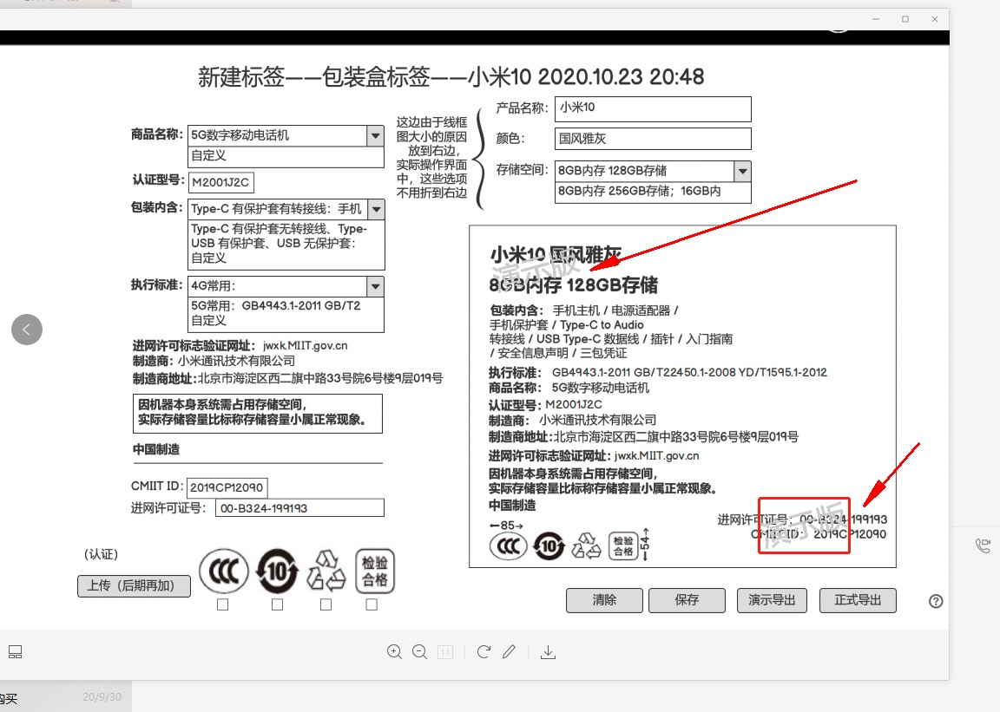

= PDF 标签项目

PDF 标签项目，根据标签信息采用 https://www.dita-ot.org/[dita] 技术生成 PDF 文件。

== 参考资料

=== 演示地址

http://101.200.133.86/index.html

admin/admin

== 术语

=== 样式

样式是外观色彩字体间距等。样式目前提供 *中文* 和 *英文* 两种。使用示例中的 *sequence.ditamap* 测试提供的样式目前报错：

.dita-ot-2.3-english
[source%nowrap]
----
$ cd dita-ot-2.3-english/docsrc/samples

#dita 命令
$ ../../bin/dita -input sequence.ditamap -format pdf

#ant 命令
$ ../../../bin/ant -f build-chm-pdf.xml
----

所以实际过程中使用默认样式。

=== 模版

模版是内容布局，字段的摆放顺序。样式和模版不同，模版可以在后台维护管理。目前尚未提供模版文件，所以先提供好汉这边的模版：

[[standard_template]]
.好汉模版
[source%nowrap]
----
<?xml version="1.0" encoding="UTF-8"?>
<!DOCTYPE concept PUBLIC "-//OASIS//DTD DITA Concept//EN" "concept.dtd">
<concept id="topic">
   <title>
      
<text>#{goodsName} #{colour}</text>

      
<text>#{storage}</text>

   </title>
   <conbody>
      

         

            <b>包装内含: </b>#{packageContent}
         

         

            <b>执行标准: </b>#{standard}
         

         

            <b>商品名称: </b>#{goodsName}
         

         

            <b>认证型号: </b>#{modelCode}
         

         

            <b>制造商: </b>#{manufacturer}
         

         

            <b>制造商地址: </b>#{manufacturerAddress}
         

         

            <b>进网许可标志验证网址: </b>#{networkPermissionUrl}
         

         

            <b>因机器本身系统需占用存储空间，实际存储容量比标称存储容量小属正常现象。</b>
         

         

            <b>中国制造</b>
         

      

   </conbody>
</concept>
----

使用 #{placeholder} 作为占位符，替代实际值，具体导出样式上效果与图示有差别，需要完善。

=== 标签

模版填充具体数据后，即成为标签，标签可以导出成 PDF。

== 约定

如无特殊说明，字符类型字段长度均为 255，页面可输入字符数为 255/3=85。

== 功能

=== 用户

实现用户增删改查基本功能，用于登陆身份认证。

=== 附件

用于上传模版文件 zip 包。

=== 模版

.字段列表
|===
|字段名 |是否必填 |字段长度 |输入方式 |备注

|编号
|是
|32
|手动输入
|导入标签时，通过此模版编号表示对应的模版

|名称
|是
|85
|手动输入
|例如：手机礼盒标签、手表礼盒标签等等

|模版附件
|是
|--
|选择输入
|关联一个附件
|===

实现基本增删改查功能。

=== 标签信息

.字段列表
|===
|字段名 |是否必填 |字段长度 |输入方式 |备注

|样式
|是
|-
|选择选项
|包括中文和英文

|模版
|是
|-
|选择选项
|从之前录入的模版中选择

|商品名称
|是
|85
|手动输入
|

|认证型号
|是
|85
|手动输入
|

|包装内含
|是
|85
|手动输入
|

|执行标准
|是
|85
|手动输入
|

|进网许可标志验证网址
|是
|85
|-
|只读，固定为 http://jwxk.miit.gov.cn/[jwxk.miit.gov.cn^]

|制造商
|是
|85
|-
|只读，固定为 *小米通讯技术有限公司*

|制造商地址
|是
|85
|-
|只读，固定为 *北京市海淀区西二旗中路33号院6号楼9层019号*

|CMIIT ID
|是
|85
|手动输入
|

|进网许可证号
|是
|85
|手动输入
|

|产品名称
|是
|85
|手动输入
|

|颜色
|是
|85
|手动输入
|

|存储空间
|是
|85
|手动输入
|
|===

实现标签增删改查功能和如下功能：

==== 从 CSV 导入（未实现）

从 CSV 批量导入标签信息，导入完成后可在列表页查看，然后导出 PDF。

CSV 文件第一列为表头，表头列信息包括：样式、模版、商品名称、认证型号、包装内含、执行标准、CMIIT ID、进网许可证、产品名称、颜色、存储空间；其余列为数据；样式包括 default、chinese、english（也可换为对应的中文表述），目前仅支持 default；模版值填入对应模版的编码。可下载模版文件 template.csv。

==== 导出 PDF

根据标签信息，生成 PDF 文件。演示版附加演示版水印，正式版不需要水印。演示版水印遮住图示头尾的文字。暂未精确定位水印的位置。

== 模版规范

以模版 Mi_giftBox_label_Cn 为例进行说明：

[source%nowrap]
----
.
├── Mi_giftBox_label_Cn
│   ├── image
│   │   ├── border-black.svg
│   │   ├── border.svg
│   │   ├── legal_manual-white.svg
│   │   └── legal_manual.svg
│   ├── mi_giftbox_label_cn.ditamap
│   ├── template.dita
│   └── topic1.dita
├── Mi_giftBox_label_Cn.zip
----

因为 dita 模版包含多个文件，所以上传时必须是一个 zip 包，zip 包上传后会自动解压。其中 *template.dita* 为入口文件，示例内容如下：

[source%nowrap,xml]
----
<?xml version="1.0" encoding="UTF-8"?>
<!DOCTYPE concept PUBLIC "-//OASIS//DTD DITA Concept//EN" "concept.dtd">
<concept id="topic1" xml:lang="zh-CN">
    <title><text>#{goodsName} #{colour}</text><text>#{storage}</text></title> //<1>
    <shortdesc/>
    <conbody>
        <image href="image/border.svg" width="85mm" height="54mm" outputclass="border"/>
        <image href="image/border-black.svg" width="85mm" height="54mm" outputclass="border-black"/>
        

            
<b>包装内含﹕</b>#{packageContent}

            
<b>执行标准：</b>#{standard}

            
<b>商品名称﹕</b>#{goodsName}

            
<b>认证型号：</b>#{modelCode}

            
<b>制造商：</b>#{manufacturer}

            
<b>制造商地址：</b>#{manufacturerAddress}

            
<b>进网许可标志验证网址：</b><xref href="http://jwxk.MIIT.gov.cn" format="html" scope="external"
                    >jwxk.MIIT.gov.cn</xref>

            
<b>因机器本身系统需占用存储空间，</b>

            
<b>实际存储容量比标称存储容量小属正常现象。</b>

            
<b>中国制造</b>

        

        
<image outputclass="CCCLogo"/><image outputclass="10Logo"
                /><image outputclass="RecycleLogo"/><image outputclass="Qualified"/>

        
 //<2>
            
进网许可证号：#{networkLicense}

            
CMIIT ID：#{cmiitId}

            
202X.XX

        

    </conbody>
</concept>
----
<1> `#{占位符}` 会被替换为标签中的实际值后生成 PDF 文件
<2> `id="reproduction"` 表示演示版内容，会在生成正式版时删除

== 常见问题

=== Centos 7 生成 PDF 乱码

.参考
* http://blog.sina.com.cn/s/blog_5f4150730102vo0r.html
* https://blog.csdn.net/wlwlwlwl015/article/details/51482065

主要是 Centos 7 上没有中文字体，从 Window 中下载字体后，安装到 Centos 7 上。

